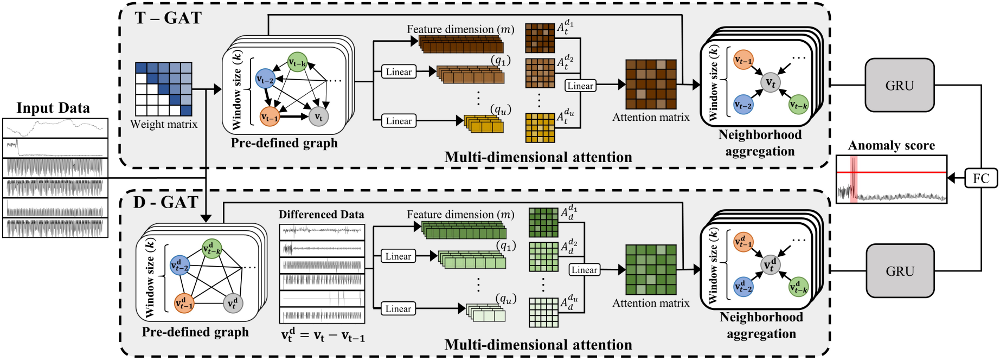
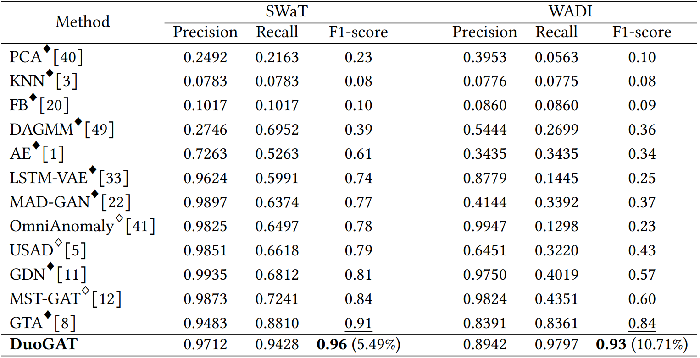
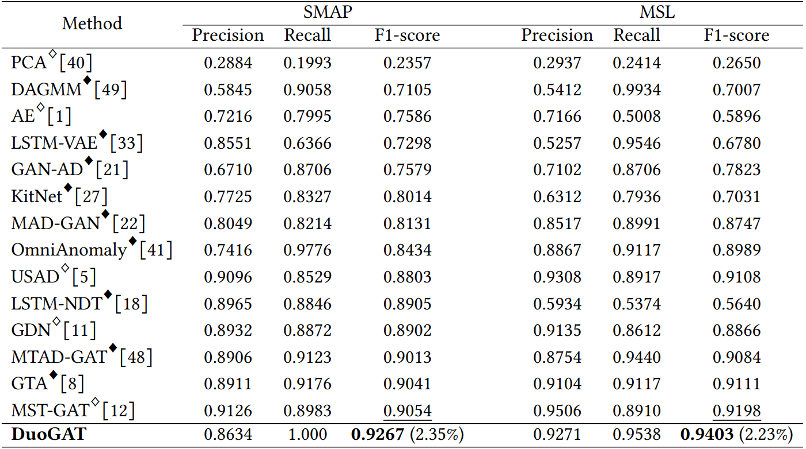

# DuoGAT: Dual Time-oriented Graph Attention Networks for Accurate, Efficient and Explainable Anomaly Detection on Time-series

## Overview

## Main results

## License
This project is licensed under the MIT License. See the [LICENSE](./LICENSE) file for details.
